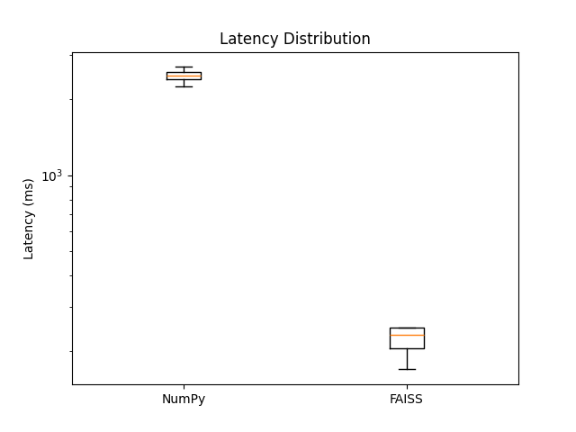
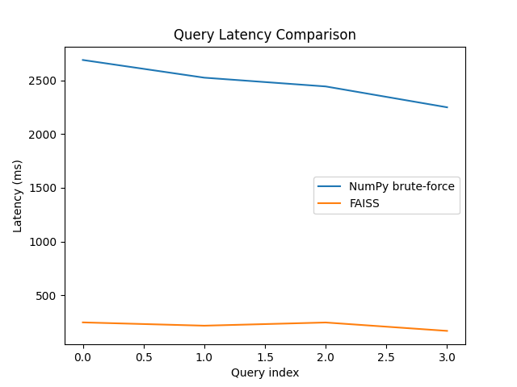

# Comparisons for vector index
This folder contains code to compare different implementations of the vector index.

You can add/edit queries in the `comparison/queries.txt` file.

## How to run comparison

```bash
python -m comparison.run_benchmark
```

Results are stored in `results.csv` file and plots in `plots/` folder.

## Implementations compared

As we will see, the FAISS implementation is significantly faster than the NumPy one.
### Latency boxplot
[](plots/latency_boxplot.png)

### Latency comparison
[](plots/latency_comparison.png)